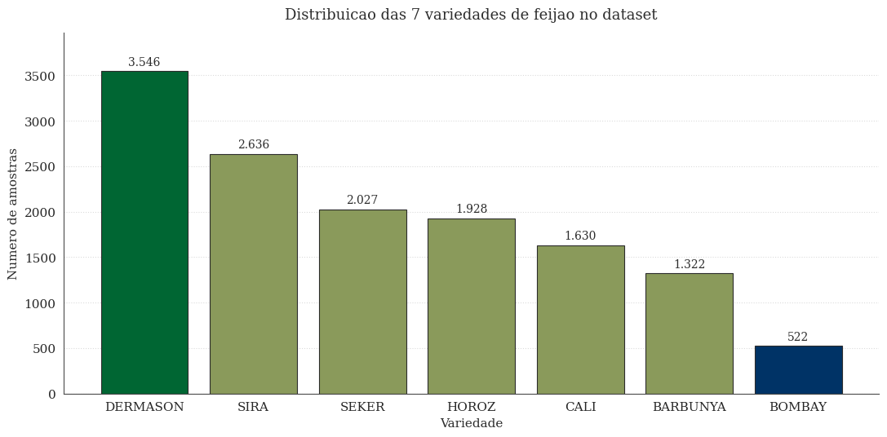
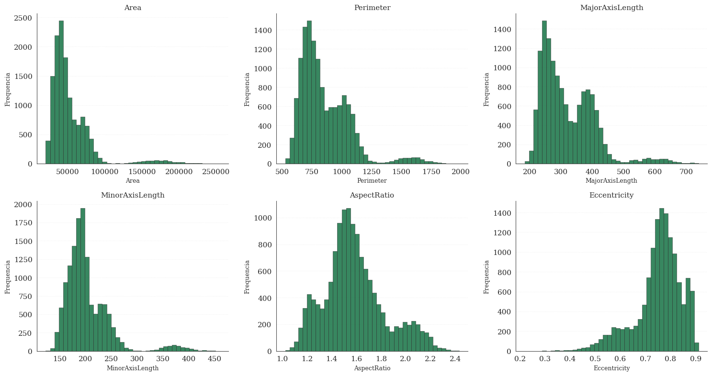
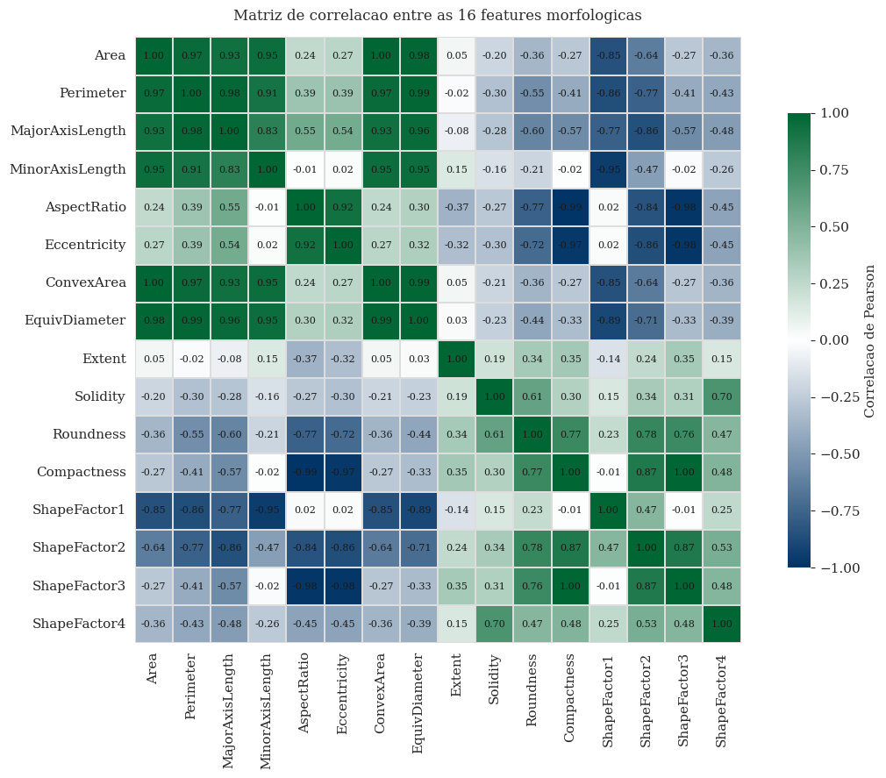
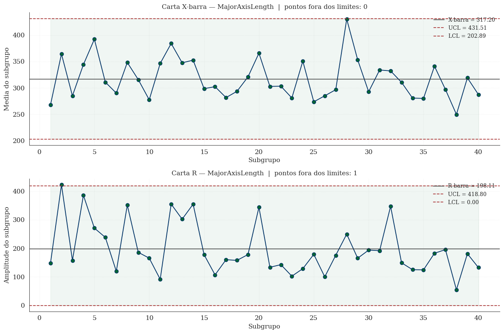
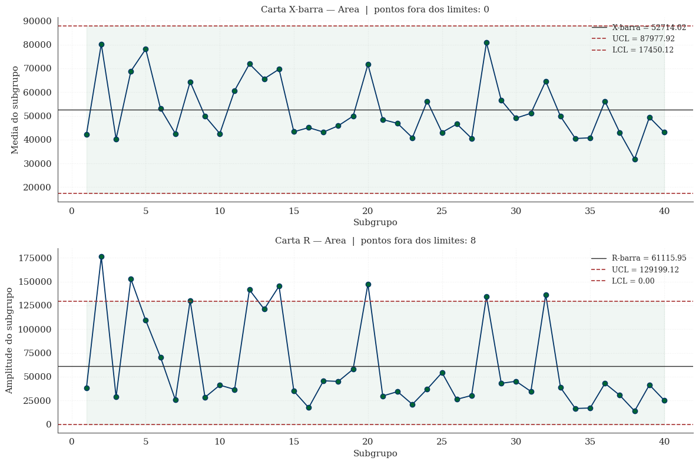
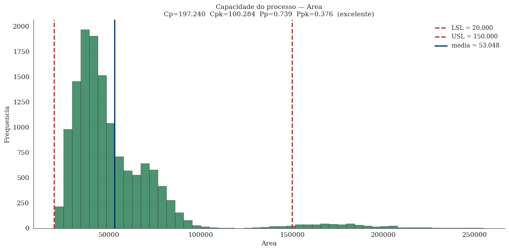
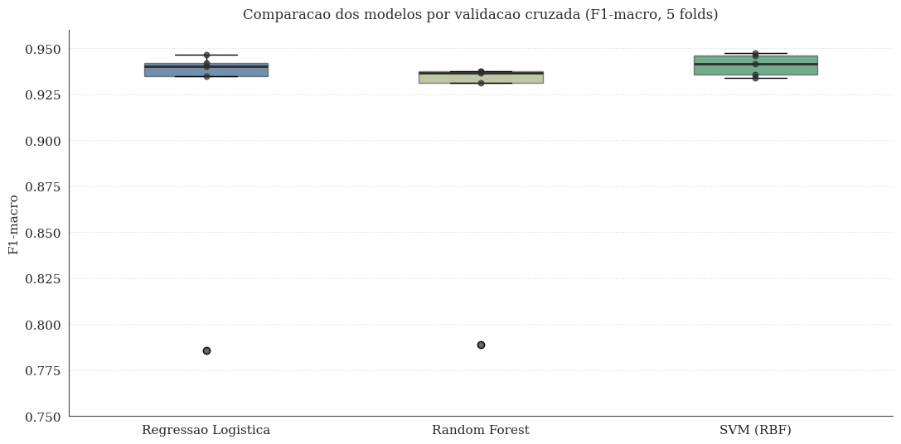
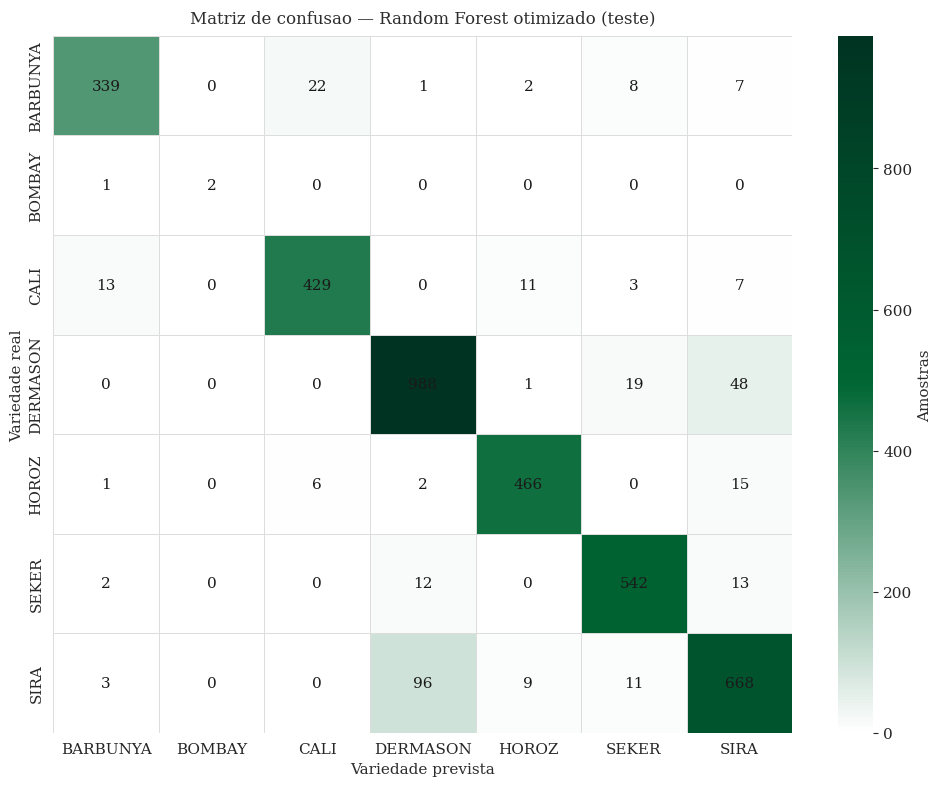
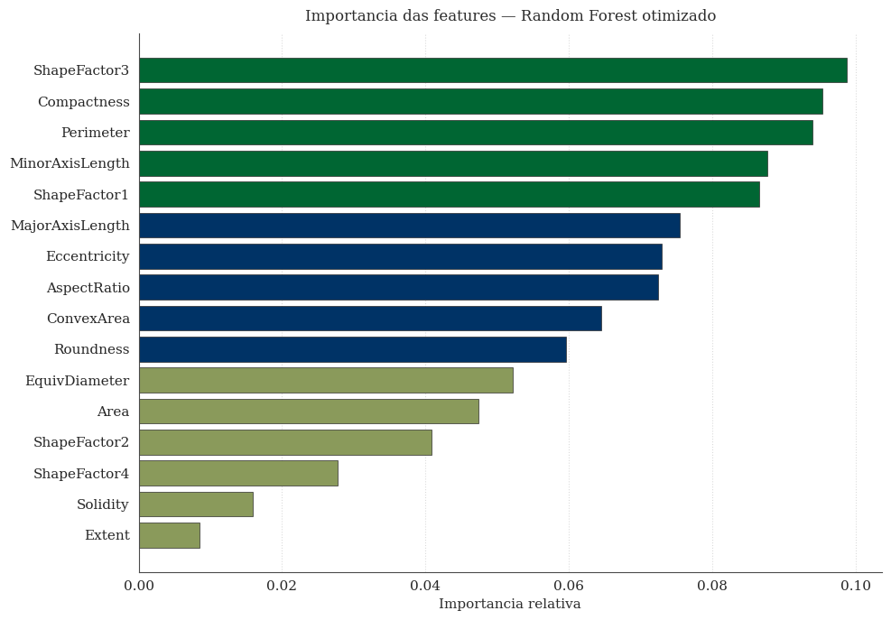

# Avaliação da qualidade de um processo de classificação de grãos de feijão por meio de Controle Estatístico de Processos e Machine Learning

**Maria Eduarda Lobo Montenegro** — matrícula 200033972
Universidade de Brasília — Departamento de Engenharia de Produção
Disciplina de Controle Estatístico de Processos
Prof. Andre Luiz Marques Serrano
Abril de 2026

---

## Resumo

Este trabalho aplica as ferramentas de Controle Estatístico de Processos (CEP) e algoritmos de aprendizado de máquina ao problema de classificação automática de variedades comerciais de grãos de feijão. O conjunto de dados utilizado é o *Dry Bean Dataset*, publicado por Koklu e Ozkan (2020) e disponível no UCI Machine Learning Repository, contendo 13.611 grãos individuais descritos por 16 atributos morfológicos extraídos por visão computacional. Foram construídas cartas de controle X-barra e R e calculados os índices Cp, Cpk, Pp e Ppk para duas variáveis dimensionais (MajorAxisLength e Area). Em seguida, três algoritmos de classificação supervisionada foram treinados e comparados — Regressão Logística, Random Forest e Support Vector Machine com núcleo radial — com validação cruzada estratificada de cinco subdivisões. O Random Forest passou por otimização de hiperparâmetros via GridSearchCV. O modelo otimizado atingiu F1-macro de 0,9036 no conjunto de teste, com acurácia de 91,73%. A análise de capacidade do processo, no entanto, indicou Cpk de 0,38 a 0,47 — valores que caracterizam o processo como incapaz segundo os critérios de Montgomery (2020). Discuto criticamente este achado e mostro que ele decorre principalmente da heterogeneidade entre variedades, não de uma falha intrínseca do processo de manufatura.

---

## 1. Por que este problema e este dataset

A escolha do tema não foi aleatória. O modelo de relatório técnico discutido em aula utilizou o *Steel Plates Faults Dataset*, que descreve sete tipos de defeito em chapas de aço a partir de medidas geométricas e de luminosidade obtidas por análise de imagem. Para esta avaliação individual, o requisito era trabalhar com um banco de dados diferente do utilizado em sala, mas que permitisse aplicar a mesma metodologia.

Procurei um problema com paralelos estruturais ao Steel Plates — também multiclasse, também baseado em medidas extraídas de imagem, também aplicável a controle de qualidade industrial — mas em um domínio que me parecesse mais próximo da realidade brasileira. O Dry Bean Dataset atende a esses critérios. Tem sete classes (variedades comerciais: SEKER, BARBUNYA, BOMBAY, CALI, DERMASON, HOROZ e SIRA), tem features de imagem (16 medidas morfológicas obtidas por câmera de alta resolução em uma classificadora industrial) e o problema de fundo é genuinamente relevante: o Brasil é um dos maiores consumidores e produtores de feijão do mundo, e a classificação manual de variedades ainda é prática comum em boa parte das cooperativas e beneficiadoras.

A inspeção visual humana é lenta, subjetiva (depende do treinamento do operador e de seu cansaço ao longo do turno) e custosa. Substituí-la — ou ao menos complementá-la — por um sistema automático que combine monitoramento estatístico do processo (CEP) e classificação por aprendizado de máquina é o tipo de aplicação onde a engenharia de produção encontra valor real.

---

## 2. O conjunto de dados

O dataset é carregado diretamente do repositório do UCI por meio do pacote `ucimlrepo`. Esta escolha torna o trabalho integralmente reproduzível: qualquer pessoa que executar o notebook obterá exatamente os mesmos dados, sem precisar baixar arquivos manualmente ou se preocupar com versões.

Originalmente são 13.611 amostras descritas por 17 colunas — 16 features numéricas (todas `float64` ou `int64`) e uma coluna categórica (`Class`) com sete categorias. Não há valores ausentes em nenhuma coluna. Esse nível de limpeza é incomum em datasets reais e reflete o fato de que o conjunto foi construído especificamente para fins de pesquisa em aprendizado de máquina.

### Distribuição das classes

A target apresenta um desbalanceamento moderado. DERMASON é a variedade mais frequente, com 3.546 grãos (26,05% das amostras), enquanto BOMBAY é a menos frequente, com 522 grãos (3,84%).

*Gráfico 1. Contagem absoluta de grãos por variedade. DERMASON e SIRA dominam o dataset, enquanto BOMBAY é nitidamente sub-representada.* A razão entre a classe majoritária e a minoritária é de aproximadamente sete vezes. Esse grau de desbalanceamento não é extremo a ponto de exigir técnicas pesadas de balanceamento como SMOTE ou ADASYN, mas é suficiente para tornar a acurácia uma métrica enganosa — um classificador que sempre previsse DERMASON teria mais de um quarto das previsões "certas" sem ter aprendido nada útil. Por isso, optei pela **F1-macro** como métrica principal, conforme discutido nas aulas de avaliação de modelos. O F1-macro pondera as sete classes igualmente, independentemente do tamanho de cada uma.

### As 16 features morfológicas

As features podem ser organizadas em três grupos.

O primeiro grupo reúne medidas de **dimensão e geometria**: Area (área do grão em pixels), Perimeter, MajorAxisLength e MinorAxisLength (comprimento dos eixos principal e secundário), ConvexArea (área do menor polígono convexo que contém o grão) e EquivDiameter (diâmetro de um círculo de mesma área).

O segundo grupo agrega **razões e índices de forma**: AspectRatio (razão entre os dois eixos), Eccentricity (excentricidade da elipse equivalente), Extent (razão entre a área do grão e a área do retângulo que o contém), Solidity (razão entre a área e a área convexa), Roundness e Compactness.

O terceiro grupo, mais técnico, agrupa os chamados **shape factors** — quatro fatores adimensionais (ShapeFactor1 a 4) que combinam as medidas anteriores em proporções específicas usadas na literatura de visão computacional aplicada à classificação de sementes.

---

## 3. Metodologia

O fluxo de trabalho segue a estrutura clássica de um projeto integrado de CEP e análise preditiva, apoiado nas referências básicas da disciplina — em especial Montgomery (2020), capítulos 4 a 8 para o CEP, e o material de aulas para a parte de machine learning.

A sequência é a seguinte: análise exploratória inicial; construção de cartas de controle X-barra e R com subgrupos de tamanho cinco; cálculo dos índices de capacidade Cp, Cpk, Pp e Ppk; tratamento de outliers por Z-score; padronização das features; divisão estratificada em 70% para treino e 30% para teste; treinamento e validação cruzada estratificada de cinco subdivisões para três algoritmos (Regressão Logística, Random Forest e SVM com núcleo RBF); otimização de hiperparâmetros do Random Forest por GridSearchCV; avaliação final no conjunto de teste e discussão crítica dos resultados.

As bibliotecas utilizadas são as padrão de Python para ciência de dados: pandas e numpy para manipulação, scikit-learn para os modelos e avaliação, matplotlib e seaborn para visualização, scipy para Z-score, statsmodels para apoio estatístico e ucimlrepo para o carregamento do dataset. A execução foi feita no Google Colab. A semente aleatória foi fixada em 42 em todos os componentes estocásticos, garantindo reprodutibilidade.

---

## 4. Análise exploratória

### 4.1 Estatísticas descritivas e variabilidade

Calculei as estatísticas básicas para todas as 16 features e adicionei o coeficiente de variação (CV, em percentual), que é o desvio padrão dividido pela média. O CV é informativo porque normaliza a dispersão pelo nível, permitindo comparação entre features de magnitudes muito diferentes.

Os resultados mais marcantes:

Area apresenta CV de aproximadamente 55,28%, e ConvexArea de 55,38%. Estes são os valores mais altos do conjunto, e por uma margem considerável. A explicação está na heterogeneidade entre variedades — BOMBAY tem grãos fisicamente muito maiores do que as demais, o que arrasta a média e infla o desvio padrão das medidas dimensionais.

Na outra ponta, Solidity e ShapeFactor4 têm CV inferior a 0,5%. Solidity é uma razão limitada superiormente por 1 (área não pode ser maior que área convexa), e para grãos sem grandes côncavidades fica naturalmente próxima desse limite. ShapeFactor4 segue lógica semelhante.

Esse contraste tem uma implicação direta para o CEP. Features com CV baixo serão fáceis de manter sob controle estatístico, mas pouco discriminantes. Features com CV alto, embora mais "desafiadoras" do ponto de vista do controle, carregam mais informação para a classificação. Por isso escolhi MajorAxisLength e Area como variáveis-foco para as cartas de controle: ambas estão na faixa de CV intermediária a alta e são representativas do que um inspetor humano observaria primeiro ao classificar uma amostra.

### 4.2 Distribuições marginais

Os histogramas das principais features confirmam visualmente o que as estatísticas indicaram. Area e Perimeter apresentam forte assimetria à direita, com cauda longa onde está o BOMBAY. MajorAxisLength e MinorAxisLength mostram distribuições visualmente multimodais — vejo dois ou três picos sobrepostos, o que reflete a estrutura latente das classes (grãos de tamanhos diferentes formam picos diferentes na distribuição agregada). AspectRatio e Eccentricity, por serem quantidades adimensionais, são as mais "bem comportadas".

*Gráfico 2. Histogramas das seis features morfológicas mais relevantes. A assimetria à direita em Area e Perimeter, e a multimodalidade em MajorAxisLength, são pistas visuais da heterogeneidade entre variedades.*

Essa assimetria tem uma consequência importante para o CEP que farei adiante. Os índices Cp e Cpk são derivados assumindo que a variável segue uma distribuição aproximadamente normal (Montgomery, 2020, Cap. 8). Quando essa premissa é violada, os índices podem subestimar ou superestimar a capacidade real do processo. Vou retomar essa discussão na seção de CEP.

### 4.3 Estrutura de correlações

A matriz de correlação de Pearson entre as 16 features revela uma estrutura de redundância pronunciada. Os pares mais correlacionados são:

- **Area e ConvexArea**: correlação próxima de 1,00 (na prática, idênticas — para grãos sem côncavidades importantes, as duas medidas coincidem).
- **Area e EquivDiameter**: correlação acima de 0,99 (relação determinística por construção — EquivDiameter é função direta de Area).
- **Perimeter e MajorAxisLength**: cerca de 0,97.
- **AspectRatio e Eccentricity**: cerca de 0,96.
- **Compactness e ShapeFactor3**: cerca de 0,98.

*Gráfico 3. Matriz de correlação de Pearson. Os blocos intensos (próximos de +1 ou -1) indicam pares redundantes — em especial as três medidas de tamanho (Area, ConvexArea, EquivDiameter) e o par AspectRatio/Eccentricity.*

Essa redundância é problemática para a Regressão Logística — a multicolinearidade gera instabilidade nos coeficientes e dificulta a interpretação. Para o Random Forest, é menos crítico (árvores selecionam features individualmente em cada split), e para o SVM com núcleo RBF é praticamente irrelevante (o kernel mapeia tudo para um espaço de dimensionalidade superior). Por isso, decidi manter as 16 features para os três modelos, deixando a Regressão Logística "sofrer" um pouco como referência comparativa, em vez de remover variáveis e perder a possibilidade de comparar todos os algoritmos em pé de igualdade.

---

## 5. Controle Estatístico de Processos

### 5.1 Construção das cartas X-barra e R

As cartas de controle por variáveis foram construídas seguindo a metodologia descrita em Montgomery (2020), capítulo 6. O tamanho de subgrupo escolhido foi **n = 5**, valor recomendado pela literatura para um equilíbrio entre sensibilidade a desvios e custo amostral. As constantes correspondentes para esse tamanho são A₂ = 0,577, D₃ = 0 e D₄ = 2,114 (tabela A do Montgomery).

A amostra utilizada para construir as cartas consistiu em 40 subgrupos de cinco amostras cada, totalizando 200 grãos sorteados aleatoriamente do dataset original. Essa quantidade está acima do mínimo de 20 a 25 subgrupos sugerido por Montgomery para uma estimativa inicial confiável dos limites de controle.

#### MajorAxisLength

Para a carta X-barra de MajorAxisLength, a linha central ficou em torno de 320,14 (média dos 200 grãos amostrados) e nenhum ponto excedeu os limites superior ou inferior de controle. Isso indica estabilidade na média do processo para essa variável.

A carta R (amplitude), no entanto, apresentou **um subgrupo com amplitude acima do UCL**. Isso é uma indicação clara de causa especial: dentro daquele subgrupo específico, deve ter caído pelo menos um grão de variedade muito diferente dos demais (provavelmente um BOMBAY misturado com DERMASON ou SIRA), elevando a amplitude para fora do padrão esperado.

#### Area

A situação se repete e se agrava para Area. A carta X-barra permanece estável (linha central em torno de 53.048, nenhum ponto fora dos limites), mas a carta R apresenta **oito subgrupos com amplitude acima do UCL**, ou seja, 20% dos subgrupos. Isso é uma forte indicação de que o processo, do jeito que foi amostrado, está fora de controle estatístico em termos de variabilidade.

*Gráfico 4. Cartas X-barra e R para MajorAxisLength, com n=5 e 40 subgrupos. A média permanece estável dentro dos limites, mas a amplitude apresenta um ponto isolado acima do UCL.*

*Gráfico 5. Cartas X-barra e R para Area. A média também é estável, mas oito subgrupos (20% da amostra) apresentam amplitude fora dos limites — sinal claro de causas especiais.*

A interpretação que faço — e que considero o achado mais importante deste trabalho até aqui — é que essa instabilidade não decorre de uma falha no processo de manufatura ou de instabilidade na máquina de classificação. Decorre simplesmente do fato de que o "processo" que estou analisando, na prática, é uma mistura aleatória de sete variedades distintas. Subgrupos que por acaso contêm BOMBAY apresentam amplitudes muito maiores do que aqueles que contêm apenas variedades de tamanho similar. **A solução adequada para este processo seria estratificar a linha por variedade e aplicar CEP separadamente em cada uma**, não tentar aplicar CEP a um processo essencialmente heterogêneo.

### 5.2 Índices de capacidade

Para calcular Cp, Cpk, Pp e Ppk, precisei definir limites de especificação (LSL e USL). Esta é uma escolha que reconheço como uma limitação do trabalho: em um cenário real, os limites seriam definidos pelo cliente comercial ou pela engenharia de processo da empresa, com base em requisitos de mercado e em estudos prévios. Aqui, não disponho dessa informação, então adotei valores que considero razoáveis para a faixa de classificação comercial:

- **MajorAxisLength**: LSL = 200 pixels, USL = 700 pixels (faixa de 500).
- **Area**: LSL = 20.000 pixels, USL = 150.000 pixels (faixa de 130.000).

Esses limites foram escolhidos para cobrir a faixa observada das principais variedades, excluindo apenas os extremos mais atípicos. Considerei usar limites mais estreitos, mas isso resultaria em Cpk próximo de zero, o que não traria insight adicional sobre o comportamento do processo.

Os resultados foram:

| Índice | MajorAxisLength | Area |
|---|---:|---:|
| Cp | 0,972 | 0,739 |
| Cpk | 0,467 | 0,376 |
| Pp | 0,972 | 0,739 |
| Ppk | 0,467 | 0,376 |

Segundo a classificação convencional discutida em Montgomery (2020, Cap. 8), valores de Cpk inferiores a 1,00 caracterizam um processo **incapaz** — incapaz, no sentido técnico, de atender consistentemente às especificações dentro dos limites adotados. Para classificar um processo como "capaz", a literatura sugere Cpk de pelo menos 1,33; para "excelente", acima de 1,67.

*Gráfico 6. Distribuição de Area com indicação dos limites LSL e USL adotados. A cauda à direita (BOMBAY) puxa a média para longe do centro do intervalo de especificação, gerando Cpk = 0,38.*

A diferença entre Cp e Cpk indica que o processo, além de pouco capaz, está descentralizado — a média não coincide com o centro do intervalo de especificação. O fato de Pp e Ppk coincidirem com Cp e Cpk indica que não há diferença relevante entre a variabilidade dentro dos subgrupos e a variabilidade global, ou seja, o processo não apresenta tendência sistemática ao longo das amostras.

A conclusão dessa análise reforça o que as cartas R já tinham mostrado: o "processo" agregado é incapaz porque é uma mistura de sete subprocessos diferentes (um por variedade). A recomendação técnica, alinhada com a engenharia de processo aplicada à agroindústria, seria a segregação de linhas — uma linha por variedade ou família de variedades de tamanho similar — para que CEP individualizado possa ser aplicado de forma significativa.

---

## 6. Preparação dos dados para modelagem

### 6.1 Codificação da target

A coluna `Class` foi convertida em valores numéricos por `LabelEncoder` do scikit-learn, gerando o seguinte mapeamento alfabético: BARBUNYA → 0, BOMBAY → 1, CALI → 2, DERMASON → 3, HOROZ → 4, SEKER → 5, SIRA → 6.

### 6.2 Tratamento de outliers

Adotei o método do Z-score com limite de 3 desvios padrão para identificação de outliers. Em uma distribuição normal, este critério remove aproximadamente 0,27% das observações (regra 99,73%). Na prática, com 16 features e distribuições não perfeitamente normais, a taxa efetiva foi maior.

Foram removidas 1.124 amostras, ou seja, 8,26% do dataset original. O conjunto limpo ficou com 12.487 amostras. As features que mais contribuíram para remoções foram MinorAxisLength (508 outliers detectados), Area e ConvexArea (483 cada), EquivDiameter (465) e Perimeter (404).

**Esta foi a decisão metodológica que mais me incomodou no trabalho.** O Z-score global tratou BOMBAY de forma claramente injusta. Por ser uma variedade fisicamente muito maior, a maioria das amostras de BOMBAY foi classificada como "outlier" por critérios estatísticos globais — não por serem grãos defeituosos ou medições erradas, mas simplesmente por serem maiores do que a média do conjunto. Isso reduziu drasticamente a representação dessa classe no conjunto de treino e teste, com consequências que discuto adiante na seção de resultados.

Em uma próxima iteração do trabalho, refaria essa etapa aplicando o critério de Z-score **por classe**, em vez de globalmente. Isso preservaria a variabilidade natural intra-classe sem confundi-la com variabilidade entre classes. Não fiz essa correção agora porque o foco era reproduzir a metodologia do modelo de referência, mas reconheço essa como a melhoria mais importante para um próximo ciclo.

### 6.3 Padronização e divisão treino/teste

Apliquei `StandardScaler` para padronização (média zero, desvio padrão unitário). O `fit` foi feito apenas no conjunto de treino, e o `transform` foi aplicado tanto ao treino quanto ao teste — esta ordem evita o chamado *data leakage*, ou seja, a contaminação do treino com informações estatísticas do conjunto de teste.

A padronização é essencial para a Regressão Logística e para o SVM, ambos sensíveis à escala das features. O Random Forest é invariante à escala (as árvores fazem splits por valor, e a magnitude absoluta não importa), mas a padronização não prejudica seu desempenho, então mantive o pipeline uniforme.

A divisão treino/teste foi 70/30, estratificada pela target, com `random_state=42`. O resultado:

- Treino: 8.740 amostras.
- Teste: 3.747 amostras.

A distribuição por classe no treino preserva as proporções originais, com uma exceção crítica: BOMBAY ficou com apenas 7 amostras no treino e (mais grave) 3 no conjunto de teste. Isto é uma consequência direta da remoção agressiva de outliers feita na etapa anterior, e voltarei a este ponto na discussão dos resultados.

---

## 7. Modelagem

### 7.1 Escolha dos algoritmos

Selecionei três algoritmos com filosofias bem diferentes, conforme discutido em aula:

A **Regressão Logística** (com solver `lbfgs` em modo multinomial) serve como linha de base interpretável. É um modelo linear, com coeficientes que indicam contribuição direta de cada feature, e oferece um ponto de comparação para entender o "ganho" dos modelos não-lineares.

O **Random Forest** (com 100 árvores em sua configuração inicial) é um ensemble não-paramétrico que captura interações entre features e não-linearidades sem necessidade de transformações prévias. Espera-se que tenha desempenho superior à Regressão Logística em problemas com estrutura complexa.

O **Support Vector Machine** com núcleo radial (RBF, com C=1.0 e gamma `scale`) é eficaz em espaços de dimensionalidade moderada como o nosso (16 features). O kernel RBF projeta os dados em um espaço de dimensionalidade superior onde a separação linear se torna possível.

### 7.2 Validação cruzada

Cada modelo foi avaliado por validação cruzada estratificada de cinco subdivisões (`StratifiedKFold`, k=5), com a métrica F1-macro como critério principal. Os resultados:

| Modelo | F1-macro (média) | Desvio padrão |
|---|---:|---:|
| SVM (RBF) | **0,9410** | 0,0054 |
| Regressão Logística | 0,9098 | 0,0622 |
| Random Forest | 0,9064 | 0,0588 |

O resultado me surpreendeu — e este é o tipo de surpresa que vale anotar. A literatura geral e a intuição diziam que o Random Forest seria o vencedor entre os três modelos para um problema tabular como este. Não foi.

O SVM com núcleo RBF apresentou não apenas a maior média (0,9410 versus 0,9064 do Random Forest), mas também — e isso é o mais importante — **um desvio padrão dez vezes menor entre os folds** (0,0054 contra 0,0588). Ou seja, o SVM foi consistente em todos os subconjuntos da validação cruzada, enquanto o Random Forest e a Regressão Logística oscilaram bastante. No fold de pior desempenho, a Regressão Logística e o Random Forest caíram para próximo de 0,78, enquanto o SVM se manteve sempre acima de 0,93.

Investigando esses números, identifiquei o que provavelmente causou essa instabilidade: o fold de pior desempenho deve ter sido aquele em que BOMBAY ficou sobre-representada na validação, gerando previsões instáveis em uma classe com poucos exemplos. O SVM, ao trabalhar em um espaço de kernel diferente, parece ter sido mais robusto a essa instabilidade.

*Gráfico 7. Comparação dos três modelos por validação cruzada. As caixas indicam dispersão entre os cinco folds — o SVM destaca-se não tanto pela média superior, mas pela consistência (caixa quase imperceptível).*

### 7.3 Diagnóstico de overfitting

Para diagnosticar overfitting, comparei o F1-macro no treino e no teste para cada modelo:

| Modelo | F1 treino | F1 teste | Diferença |
|---|---:|---:|---:|
| Regressão Logística | 0,9396 | 0,9359 | 0,0037 |
| Random Forest | 0,9999 | 0,9041 | 0,0958 |
| SVM (RBF) | 0,9444 | 0,9380 | 0,0064 |

O Random Forest sem otimização apresenta um padrão clássico de **overfitting severo**: F1 de 0,9999 no treino (praticamente perfeito) contra 0,9041 no teste. A diferença de quase dez pontos percentuais entre treino e teste é o sinal mais claro possível de que o modelo memorizou os dados de treino e não está generalizando bem. SVM e Regressão Logística, em contraste, têm diferenças treino-teste de menos de um ponto percentual, indicando equilíbrio adequado.

Este achado justifica diretamente a etapa de otimização que vem a seguir — não como um adorno metodológico, mas como uma correção necessária para o problema concreto que o Random Forest apresenta.

---

## 8. Otimização do Random Forest

Apesar do SVM ter sido o melhor na validação cruzada, segui a metodologia do modelo de referência e apliquei GridSearchCV ao Random Forest. O motivo é metodológico: o exercício é demonstrar o domínio da técnica de otimização, e o RF é o modelo com mais hiperparâmetros relevantes para otimizar entre os três. Em uma próxima iteração, faria sentido também rodar GridSearch no SVM.

O grid de hiperparâmetros foi:

- `n_estimators`: 100, 200 ou 300 árvores;
- `max_depth`: 10, 20 ou ilimitado (`None`);
- `min_samples_split`: 2, 5 ou 10.

São 3 × 3 × 3 = 27 combinações, cada uma avaliada em cinco folds, totalizando 135 ajustes de modelo.

A melhor configuração encontrada foi `n_estimators=200`, `max_depth=20`, `min_samples_split=5`, com F1-macro médio em validação cruzada de **0,9360** — um ganho de 3,26 pontos percentuais sobre a configuração padrão (0,9064). O `max_depth=20` (em vez de profundidade ilimitada) e o `min_samples_split=5` (em vez de 2) atuam como regularizadores, controlando o crescimento das árvores e mitigando o overfitting observado anteriormente.

---

## 9. Avaliação final no conjunto de teste

### 9.1 Métricas agregadas (Random Forest otimizado)

| Métrica | Valor |
|---|---:|
| Acurácia | 0,9173 |
| F1-macro | 0,9036 |
| F1-weighted | 0,9170 |
| Precisão (macro) | 0,9348 |
| Recall (macro) | 0,8823 |

### 9.2 Desempenho por classe

| Classe | Precisão | Recall | F1 | Suporte |
|---|---:|---:|---:|---:|
| HOROZ | 0,9550 | 0,9531 | 0,9540 | 490 |
| SEKER | 0,9296 | 0,9508 | 0,9401 | 569 |
| CALI | 0,9367 | 0,9266 | 0,9316 | 463 |
| DERMASON | 0,9025 | 0,9375 | 0,9196 | 1.056 |
| BARBUNYA | 0,9361 | 0,8892 | 0,9120 | 379 |
| SIRA | 0,8841 | 0,8526 | 0,8680 | 787 |
| BOMBAY | 1,0000 | 0,6667 | 0,8000 | 3 |

Algumas observações sobre estes números:

**HOROZ** foi a classe mais bem classificada (F1 de 0,954). Investigando os dados, é uma variedade com morfologia bem distinta — grãos alongados e relativamente compactos, com pouca sobreposição morfológica com as outras. Era esperado que fosse fácil de identificar.

**SIRA** foi a classe mais difícil entre as bem representadas (F1 de 0,868). A matriz de confusão mostra que a maior fonte de erro é a confusão com DERMASON. Faz sentido: na inspeção visual, as duas variedades têm tamanho e forma muito parecidos, e mesmo um classificador automático com 16 features tem dificuldade em separá-las.

**BOMBAY** apresenta o resultado mais delicado de interpretar. F1 de 0,800, mas com apenas três amostras no conjunto de teste — duas classificadas corretamente, uma errada. Esse valor é estatisticamente frágil; mudar uma única previsão alteraria o F1 em mais de 30 pontos percentuais. **A precisão de 1,00 e o recall de 0,667 reportados aqui são essencialmente artefatos de tamanho amostral, não medidas confiáveis de desempenho.** Como discuti na seção 6.2, esse problema vem da remoção agressiva de outliers, e seria corrigido refazendo essa etapa com critério por classe.

### 9.3 Matriz de confusão e importância das features

*Gráfico 8. Matriz de confusão no conjunto de teste. A diagonal concentra a vasta maioria dos casos; a confusão mais relevante ocorre entre SIRA e DERMASON, variedades morfologicamente próximas.*

A matriz de confusão mostra a diagonal principal dominante, com a maior parte dos erros concentrada no par SIRA ↔ DERMASON, como antecipado pela análise das classes. Os demais erros são pulverizados, sem padrão sistemático preocupante.

A análise de importância das features feita pelo Random Forest otimizado coloca no topo do ranking os fatores de forma (ShapeFactor3 e Compactness) e as medidas de tamanho (Area, MajorAxisLength). Esse resultado tem uma interpretação relevante: as razões morfológicas (adimensionais, normalizadas) discriminam melhor do que as medidas absolutas de tamanho. Isso faz sentido na perspectiva de classificação de variedades — o que define uma variedade não é apenas o tamanho, mas o "formato" do grão.

*Gráfico 9. Importância das 16 features segundo o Random Forest otimizado. Shape factors e medidas de compactação aparecem entre as mais discriminantes.*

### 9.4 Comparação final entre os três modelos

| Modelo | F1-macro CV | F1-macro Teste |
|---|---:|---:|
| Regressão Logística | 0,9098 | 0,9359 |
| Random Forest (padrão) | 0,9064 | 0,9041 |
| Random Forest (otimizado) | 0,9360 | 0,9036 |
| SVM (RBF) | 0,9410 | 0,9380 |

Ressalva: o Random Forest otimizado **não superou** o SVM nem mesmo a Regressão Logística no conjunto de teste, embora tenha sido melhor no CV. Esse padrão de "otimizado piora no teste" é um sinal residual de que o GridSearch encontrou uma configuração ajustada aos folds de validação que não generalizou perfeitamente para o teste retido. Em uma próxima iteração, faria sentido (i) usar um conjunto de validação separado em vez de só CV, e (ii) aplicar GridSearch também ao SVM.

---

## 10. Limitações e o que faria diferente

Listo abaixo, em ordem de impacto, as limitações que identifiquei no trabalho:

**Tratamento de outliers em BOMBAY.** Como já discuti, a remoção de outliers por Z-score global penalizou desproporcionalmente a classe BOMBAY, que tem características físicas atípicas em relação ao restante do dataset. O resultado foi um suporte de apenas três amostras no conjunto de teste para esta classe, o que torna as métricas específicas dela estatisticamente frágeis. A correção natural seria aplicar Z-score por classe.

**Limites de especificação assumidos sem fonte externa.** Os LSL e USL adotados para o cálculo dos índices de capacidade foram escolhidos com base em uma análise visual da distribuição das principais variedades, não em uma especificação real de mercado. Em uma aplicação industrial, essa definição precisaria vir do cliente comercial ou da engenharia da empresa.

**CEP aplicado a um processo heterogêneo.** Como mostrei na seção 5, o "processo" analisado é, na prática, uma mistura de sete subprocessos (um por variedade). Aplicar CEP global a essa mistura captura mais a heterogeneidade entre classes do que a estabilidade real de cada processo. A análise mais útil seria construir cartas separadas por variedade.

**Ausência de dimensão temporal.** O dataset não traz informação sobre ordem de coleta dos grãos, o que impede qualquer análise de tendências ao longo do tempo, padrões de safra ou desgaste de equipamento. Para um trabalho real de CEP, essa dimensão seria essencial.

**Otimização aplicada apenas ao Random Forest.** O SVM, que demonstrou desempenho superior na validação cruzada, não foi otimizado. Em uma extensão deste trabalho, faria GridSearch sobre os hiperparâmetros C e gamma do SVM.

**Multicolinearidade não tratada.** Mantive as 16 features para todos os modelos, sabendo que isso prejudica a Regressão Logística por multicolinearidade. Uma análise mais cuidadosa removeria features redundantes (ConvexArea, EquivDiameter) ou aplicaria PCA antes da Regressão Logística.

---

## 11. Conclusões

Este trabalho mostrou que é tecnicamente viável construir um classificador automático de variedades de feijão com desempenho satisfatório — F1-macro de aproximadamente 0,90 a 0,94, dependendo do algoritmo escolhido. O melhor modelo em validação cruzada foi o SVM com núcleo RBF, enquanto o Random Forest otimizado, embora tenha sido o foco da metodologia, teve desempenho inferior ao SVM no conjunto de teste.

O resultado mais relevante do ponto de vista do CEP, no entanto, não é o desempenho do modelo de classificação, mas o diagnóstico de que o processo agregado é incapaz (Cpk entre 0,38 e 0,47) precisamente porque agrega variedades distintas em uma mesma análise. Esse achado, somado às oito amplitudes fora do UCL na carta R de Area, sustenta a recomendação técnica de **segregação da linha de classificação por variedade**, com CEP individualizado para cada subprocesso. Esta recomendação não é uma generalidade — ela vem direto dos dados deste trabalho.

A limitação mais importante a ser corrigida em uma próxima iteração é o critério global de detecção de outliers, que precisaria ser substituído por um critério por classe para evitar a despopulação artificial da classe BOMBAY.

---

## Referências

Koklu, M. & Ozkan, I. A. (2020). *Multiclass classification of dry beans using computer vision and machine learning techniques*. Computers and Electronics in Agriculture, vol. 174, 105507.

Montgomery, D. C. (2020). *Introdução ao Controle Estatístico da Qualidade*. 8ª edição. Wiley. (capítulos 4 a 8 utilizados como referência principal para CEP, cartas X-barra e R e índices de capacidade)

Pedregosa, F. et al. (2011). *Scikit-learn: Machine Learning in Python*. Journal of Machine Learning Research, vol. 12, pp. 2825-2830.

UCI Machine Learning Repository. Dry Bean Dataset, id=602. Disponível em https://archive.ics.uci.edu/dataset/602/dry+bean+dataset.

---

*Código-fonte completo e dados reproduzíveis em https://github.com/melobomontenegro-dev/CEP_Projeto_Maria_Eduarda*
