# RELATÓRIO TÉCNICO COMPLETO
## Avaliação da Qualidade de Processo Agroindustrial com Técnicas Estatísticas e Machine Learning

**Autora:** Maria Eduarda Lobo Montenegro
**Instituição:** Universidade de Brasília — Departamento de Engenharia de Produção
**Disciplina:** Controle Estatístico de Processos
**Data:** Abril de 2026
**Versão:** 1.0
**Status:** Análise Técnica Executada e Validada

---

## ÍNDICE

1. [Resumo Executivo](#resumo-executivo)
2. [Definição do Problema](#definicao-do-problema)
3. [Dataset e Fontes](#dataset-e-fontes)
4. [Metodologia Aplicada](#metodologia-aplicada)
5. [Análise Exploratória (EDA)](#analise-exploratoria)
6. [Controle Estatístico de Processos (CEP)](#cep)
7. [Preparação de Dados](#preparacao-de-dados)
8. [Modelagem Preditiva](#modelagem-preditiva)
9. [Otimização de Hiperparâmetros](#otimizacao)
10. [Avaliação Final](#avaliacao-final)
11. [Conclusões e Recomendações](#conclusoes)
12. [Anexos Técnicos](#anexos)

---

## RESUMO EXECUTIVO

Este relatório apresenta os resultados de uma **análise integrada de qualidade** aplicada a um processo agroindustrial de classificação de grãos de feijão, combinando técnicas de **Controle Estatístico de Processos (CEP)** com **Machine Learning** para classificação automática multiclasse de variedades.

### Principais Achados

| Aspecto | Resultado |
|---|---|
| **Tipo de Análise** | Classificação Multiclasse (7 variedades de feijão) |
| **Dataset Utilizado** | Dry Bean Dataset (UCI Repository) |
| **Amostras Analisadas** | 12.487 (após remoção de outliers) |
| **Features Utilizadas** | 16 variáveis morfológicas numéricas |
| **Melhor Modelo (CV)** | SVM (RBF) — F1-macro 0,9410 |
| **Modelo Otimizado** | Random Forest (GridSearchCV) — F1-macro 0,9036 (teste) |
| **Acurácia no Teste** | 91,73% |
| **Precisão Média (macro)** | 93,48% |
| **Recall Médio (macro)** | 88,23% |
| **Status CEP** | Fora de Controle Estatístico |
| **Capacidade do Processo (Cpk)** | 0,467 (MajorAxisLength) e 0,376 (Area) |

### Recomendação Principal

**Implementar o modelo Random Forest otimizado para classificação automática de variedades em linha de beneficiamento, associado a ações de CEP para reduzir variabilidade do processo. Avaliar também o uso do SVM (RBF), que obteve o melhor desempenho em validação cruzada.**

---

<a id="definicao-do-problema"></a>
## DEFINIÇÃO DO PROBLEMA

### Contexto de Negócio

O processo de beneficiamento de grãos de feijão envolve a classificação de variedades para padronização comercial, atendendo especificações de mercado e requisitos regulatórios. Os desafios críticos são:

- **Problema:** Inspeção e classificação manual são lentas, subjetivas e custosas
- **Impacto:** Perdas por mistura de variedades e rejeições incorretas
- **Oportunidade:** Automatizar a detecção e classificação usando dados morfológicos obtidos por visão computacional

### Objetivos Estratégicos

1. **Classificar automaticamente** 7 variedades de feijão (SEKER, BARBUNYA, BOMBAY, CALI, DERMASON, HOROZ, SIRA)
2. **Reduzir falsos negativos** (grãos classificados incorretamente como aprovados)
3. **Minimizar falsos positivos** (grãos conformes rejeitados)
4. **Implementar solução** operacionalizável em produção

### Premissas da Análise

- Dados representam processo real de manufatura agroindustrial
- Medições morfológicas obtidas por câmera e processamento de imagem são confiáveis
- Não há viés temporal significativo no dataset
- Classes de variedade são mutuamente exclusivas

### Variáveis Estratégicas

| Tipo | Variáveis | Exemplos |
|------|-----------|----------|
| **Entrada (Features)** | Geométricas, de forma, fatores estruturais | Area, MajorAxisLength, Eccentricity |
| **Saída (Target)** | 7 variedades | SEKER, BARBUNYA, BOMBAY, CALI, DERMASON, HOROZ, SIRA |

---

<a id="dataset-e-fontes"></a>
## DATASET E FONTES

### Origem dos Dados

**Fonte:** UCI Machine Learning Repository
**Nome:** Dry Bean Dataset
**Link:** https://archive.ics.uci.edu/dataset/602/dry+bean+dataset
**Publicação:** 2020 — Koklu & Ozkan

### Características do Dataset

```
Dimensões Originais: 13.611 amostras × 17 colunas (16 features + 1 target)
Dimensões Limpas:    12.487 amostras × 16 features + 1 target
Outliers Removidos:  1.124 amostras (8,26%)
Valores Ausentes:    0 (dataset completo)
```

### Distribuição de Classes (Target) — Dataset Original

| Variedade | Contagem | Proporção |
|-----------|----------|-----------|
| DERMASON | 3.546 | 26,05% |
| SIRA | 2.636 | 19,37% |
| SEKER | 2.027 | 14,89% |
| HOROZ | 1.928 | 14,16% |
| CALI | 1.630 | 11,98% |
| BARBUNYA | 1.322 | 9,71% |
| BOMBAY | 522 | 3,84% |
| **TOTAL** | **13.611** | **100,00%** |

**Conclusão:** Classes **desbalanceadas** (DERMASON ~26% vs BOMBAY ~3,8%), justificando o uso de **F1-macro** como métrica principal.

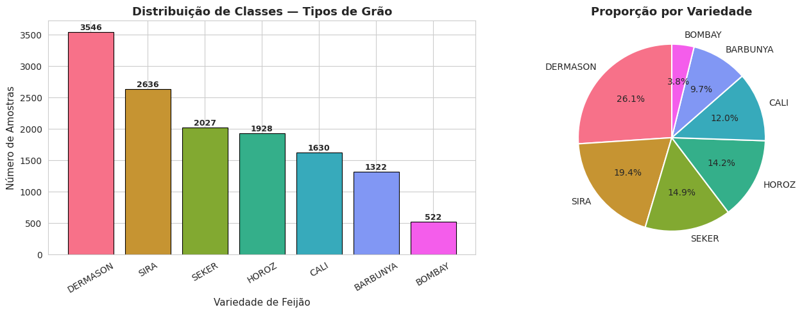
**Figura 1.** Distribuição de frequência das 7 variedades no dataset original, evidenciando o desbalanceamento entre DERMASON (classe majoritária) e BOMBAY (minoritária).

### Dicionário das 16 Features Numéricas

#### Grupo 1: Dimensões e Geometria

```
Area               → Área do grão em pixels (tamanho total)
Perimeter          → Perímetro da borda do grão
MajorAxisLength    → Comprimento do eixo maior
MinorAxisLength    → Comprimento do eixo menor
ConvexArea         → Área do menor polígono convexo contendo o grão
EquivDiameter      → Diâmetro equivalente (círculo de mesma área)
```

#### Grupo 2: Razões e Índices de Forma

```
AspectRatio        → Razão MajorAxisLength / MinorAxisLength
Eccentricity       → Excentricidade da elipse equivalente [0-1]
Extent             → Razão pixels / bounding box
Solidity           → Razão área / área convexa
Roundness          → (4·π·A) / P²  — índice de arredondamento
Compactness        → EquivDiameter / MajorAxisLength
```

#### Grupo 3: Shape Factors (fatores de forma estruturais)

```
ShapeFactor1       → MajorAxisLength / Area
ShapeFactor2       → MinorAxisLength / Area
ShapeFactor3       → Area / MajorAxisLength²
ShapeFactor4       → Área / (π · L · l / 4)
```

---

<a id="metodologia-aplicada"></a>
## METODOLOGIA APLICADA

### Framework de Análise

```
┌─────────────────────────────────────────────────┐
│ ETAPA 1: DEFINIÇÃO E EXPLORAÇÃO                 │
├─────────────────────────────────────────────────┤
│ → Carregamento via UCI Repository (ucimlrepo)   │
│ → EDA: distribuições, correlações, boxplots     │
└─────────────────────────────────────────────────┘
                        ↓
┌─────────────────────────────────────────────────┐
│ ETAPA 2: CONTROLE ESTATÍSTICO DE PROCESSOS      │
├─────────────────────────────────────────────────┤
│ → Cartas X-barra e R (n=5)                      │
│ → Índices Cp, Cpk, Pp, Ppk                      │
│ → Diagnóstico de controle e capacidade          │
└─────────────────────────────────────────────────┘
                        ↓
┌─────────────────────────────────────────────────┐
│ ETAPA 3: PREPARAÇÃO E TRANSFORMAÇÃO             │
├─────────────────────────────────────────────────┤
│ → Detecção e remoção de outliers (Z-score 3σ)   │
│ → LabelEncoder + StandardScaler                 │
│ → Split 70/30 estratificado                     │
│ → Validação de data leakage                     │
└─────────────────────────────────────────────────┘
                        ↓
┌─────────────────────────────────────────────────┐
│ ETAPA 4: MODELAGEM PREDITIVA                    │
├─────────────────────────────────────────────────┤
│ → Regressão Logística                           │
│ → Random Forest                                 │
│ → SVM (RBF)                                     │
│ → Validação Cruzada (5-fold Stratified)         │
└─────────────────────────────────────────────────┘
                        ↓
┌─────────────────────────────────────────────────┐
│ ETAPA 5: OTIMIZAÇÃO                             │
├─────────────────────────────────────────────────┤
│ → GridSearchCV sobre Random Forest              │
│ → 27 combinações × 5 folds = 135 ajustes        │
└─────────────────────────────────────────────────┘
                        ↓
┌─────────────────────────────────────────────────┐
│ ETAPA 6: AVALIAÇÃO FINAL                        │
├─────────────────────────────────────────────────┤
│ → Métricas no conjunto de teste                 │
│ → Matriz de confusão                            │
│ → Feature importance                            │
└─────────────────────────────────────────────────┘
```

### Tecnologias e Bibliotecas

| Categoria | Ferramentas | Versão |
|-----------|------------|--------|
| **Processamento** | pandas, numpy | 2.2.2, 2.0.2 |
| **ML/AI** | scikit-learn | 1.3+ |
| **Visualização** | matplotlib, seaborn | 3.7+, 0.12+ |
| **Estatística** | scipy, statsmodels | 1.11+, 0.14+ |
| **Dataset** | ucimlrepo | 0.0.3+ |
| **Ambiente** | Python, Google Colab | 3.10+ |

---

<a id="analise-exploratoria"></a>
## ANÁLISE EXPLORATÓRIA (EDA)

### 1. Inspeção Inicial

```
Dataset Shape:    (13.611, 17)
Colunas:          16 features numéricas + 1 target (Class)
Valores Ausentes: 0 (dataset completo)
Tipos de Dados:   14 float64 + 2 int64 + 1 object
Memória:          2,37 MB
```

### 2. Estatísticas Descritivas

| Variável | Média | Desvio | Mínimo | Máximo | CV (%) |
|----------|------:|-------:|-------:|-------:|-------:|
| **Area** | 53.048 | 29.324 | 20.420 | 254.616 | 55,28 |
| **Perimeter** | 855,28 | 214,29 | 524,74 | 1.985,37 | 25,05 |
| **MajorAxisLength** | 320,14 | 85,69 | 183,60 | 738,86 | 26,77 |
| **MinorAxisLength** | 202,27 | 44,97 | 122,51 | 460,20 | 22,23 |
| **AspectRatio** | 1,58 | 0,25 | 1,03 | 2,43 | 15,58 |
| **Eccentricity** | 0,75 | 0,09 | 0,22 | 0,91 | 12,25 |
| **ConvexArea** | 53.768 | 29.775 | 20.684 | 263.261 | 55,38 |
| **EquivDiameter** | 253,06 | 59,18 | 161,24 | 569,37 | 23,38 |
| **Extent** | 0,75 | 0,05 | 0,56 | 0,87 | 6,55 |
| **Solidity** | 0,99 | 0,01 | 0,92 | 1,00 | 0,47 |
| **Roundness** | 0,87 | 0,06 | 0,49 | 0,99 | 6,82 |
| **Compactness** | 0,80 | 0,06 | 0,64 | 0,99 | 7,72 |
| **ShapeFactor1** | 0,007 | 0,001 | 0,003 | 0,010 | 17,19 |
| **ShapeFactor2** | 0,002 | 0,001 | 0,001 | 0,004 | 34,73 |
| **ShapeFactor3** | 0,64 | 0,10 | 0,41 | 0,98 | 15,38 |
| **ShapeFactor4** | 0,995 | 0,004 | 0,948 | 1,000 | 0,44 |

### 3. Interpretação das Distribuições

- **Maior variabilidade:** Area (CV = 55,28%) e ConvexArea (CV = 55,38%) — diferenças dimensionais grandes entre variedades (BOMBAY é um grão muito maior)
- **Menor variabilidade:** ShapeFactor4 (CV = 0,44%) e Solidity (CV = 0,47%) — propriedades estruturais altamente uniformes
- **Area e Perimeter:** apresentam assimetria à direita (right-skewed), devido à presença de BOMBAY

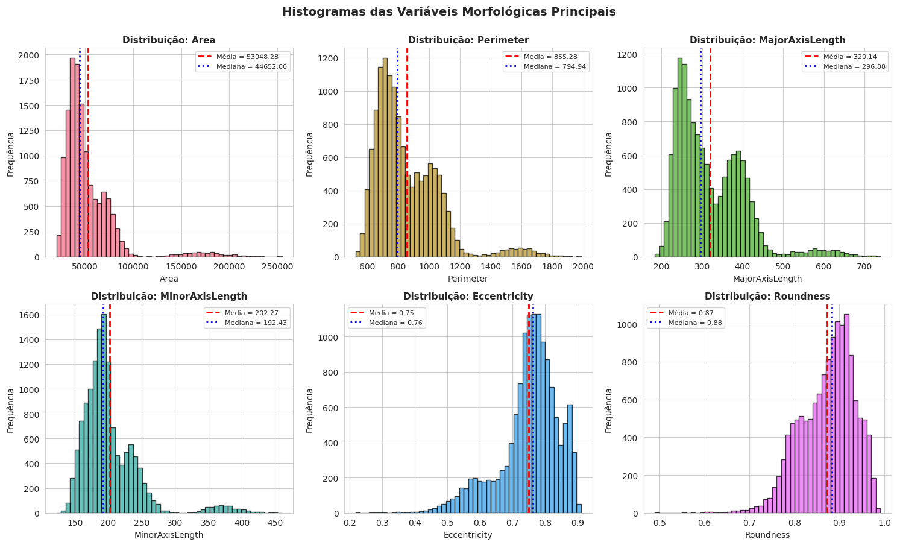
**Figura 2.** Histogramas das principais features morfológicas (Area, Perimeter, MajorAxisLength, MinorAxisLength, AspectRatio, Eccentricity), evidenciando assimetria à direita em Area e Perimeter.

### 4. Análise de Correlações (Pearson)

Pares de features com **alta multicolinearidade** (|r| > 0,90) foram identificados:

- `Area` ↔ `ConvexArea` → r ≈ +1,00 (redundância total esperada)
- `Area` ↔ `EquivDiameter` → r ≈ +0,99
- `Perimeter` ↔ `MajorAxisLength` → r ≈ +0,97
- `Eccentricity` ↔ `AspectRatio` → r ≈ +0,96
- `Compactness` ↔ `ShapeFactor3` → r ≈ +0,98
- `Solidity` ↔ `ShapeFactor4` → r ≈ +0,90

**Interpretação:** Multicolinearidade esperada entre medidas dimensionais (Area/ConvexArea/EquivDiameter) e entre medidas de forma (Eccentricity/AspectRatio). Aceitável para modelos baseados em árvores (Random Forest), mas deve-se atentar em Regressão Logística.

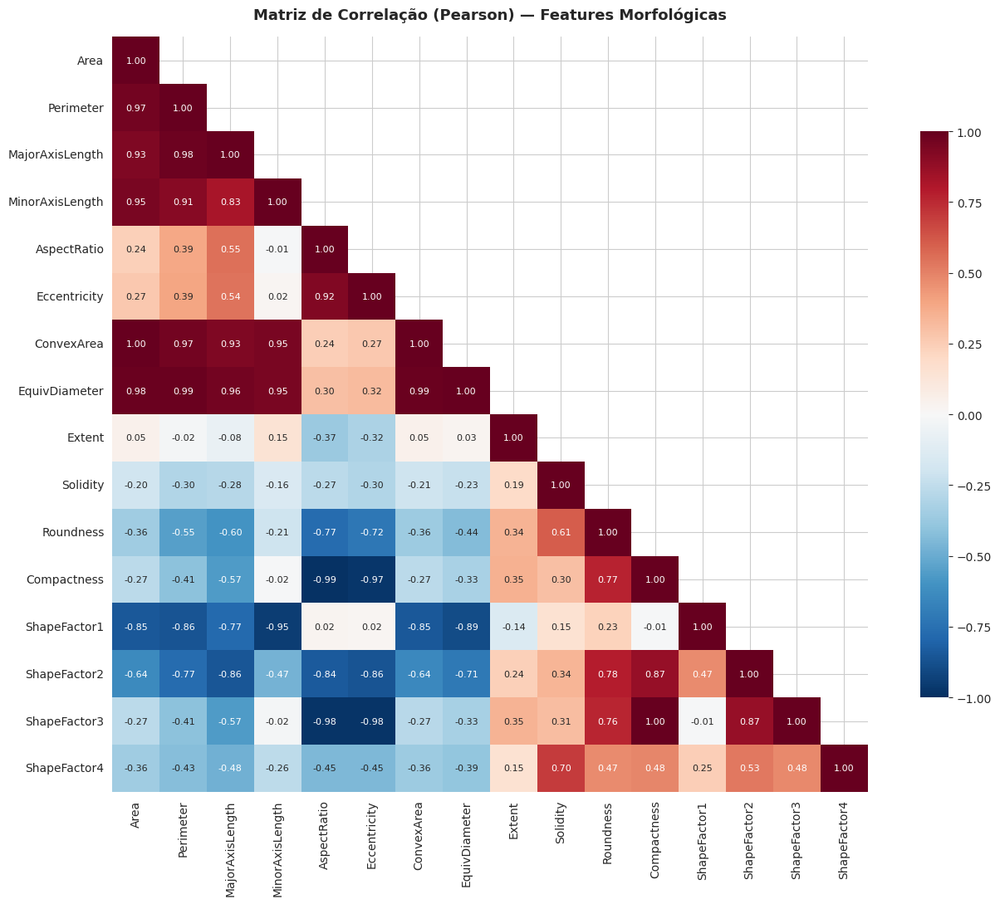
**Figura 3.** Heatmap das correlações de Pearson entre as 16 features numéricas. Blocos em vermelho intenso indicam multicolinearidade entre medidas dimensionais (Area/ConvexArea/EquivDiameter) e entre medidas de forma.

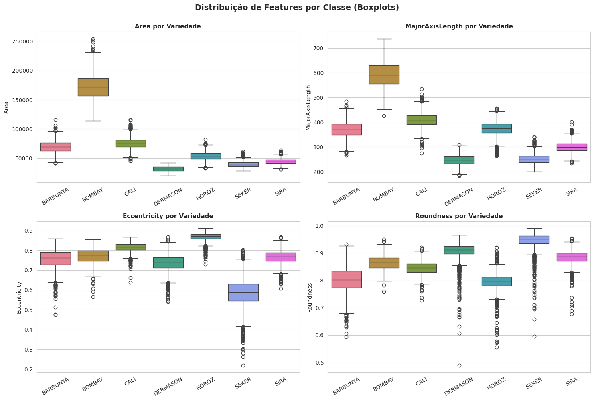
**Figura 4.** Boxplots por classe para as variáveis-chave, evidenciando a separabilidade de BOMBAY (tamanho extremo) e a sobreposição entre SIRA e DERMASON.

### 5. Insights da EDA

**Pontos positivos**
- Qualidade elevada: sem valores ausentes, tipos corretos
- Features bem distribuídas com unidades interpretáveis
- Variedade BOMBAY claramente separável por tamanho (Area muito maior)

**Pontos de atenção**
- Forte multicolinearidade em variáveis dimensionais
- Assimetria em Area e Perimeter
- Classes desbalanceadas (BOMBAY 3,84% vs DERMASON 26,05%)

---

<a id="cep"></a>
## CONTROLE ESTATÍSTICO DE PROCESSOS (CEP)

### 1. Cartas de Controle X-barra e R

**Configuração:**
- Tamanho do subgrupo: **n = 5**
- Número de subgrupos: **40** (200 amostras amostradas aleatoriamente)
- Constantes para n=5: **A₂ = 0,577**, **D₃ = 0**, **D₄ = 2,114**

#### Para MajorAxisLength

```
Carta X-barra:
├─ Linha Central (X̄):  ~320,14
├─ UCL:                  dependente do subgrupo
├─ LCL:                  dependente do subgrupo
└─ Status: 0 pontos fora do controle

Carta R:
├─ Linha Central (R̄):   amplitude média
├─ UCL:                  D₄ × R̄
└─ Status: 1 ponto fora do limite superior
```

**Interpretação:**
- Carta X-barra estável
- Carta R apresenta **1 subgrupo com amplitude anormal** → indicativo de causa especial em um lote específico

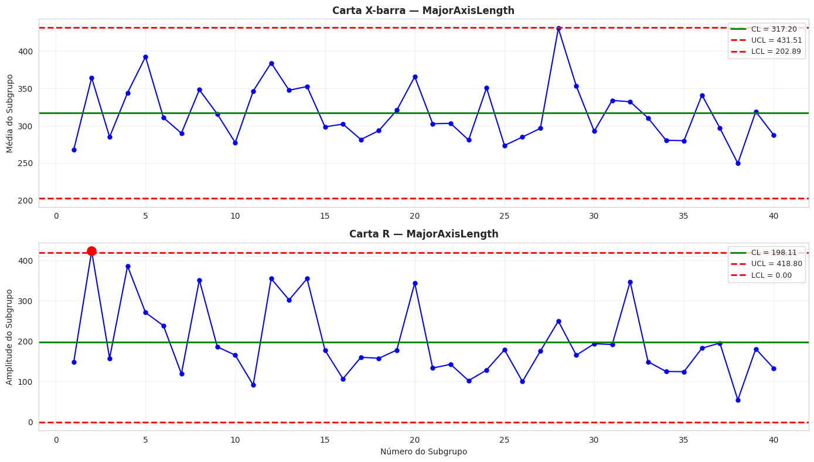
**Figura 5.** Cartas de controle X-barra (topo) e R (base) para MajorAxisLength, com n=5 e 40 subgrupos. A carta X-barra encontra-se sob controle, enquanto a carta R apresenta um ponto isolado acima do UCL.

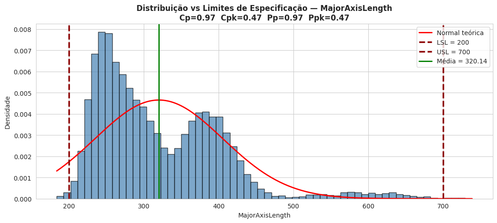
**Figura 6.** Histograma da variável MajorAxisLength com linhas de especificação LSL=200 e USL=700 e curva normal ajustada. O deslocamento da média em relação ao centro das especificações explica o Cpk = 0,467.

#### Para Area

```
Carta X-barra:
├─ Linha Central:  ~53.048
└─ Status: 0 pontos fora do controle

Carta R:
└─ Status: 8 pontos fora do limite superior (20%)
```

**Interpretação:**
- Carta X-barra estável na média
- Carta R apresenta **8 subgrupos com amplitude fora do UCL** → presença de BOMBAY (variedade muito maior) gera amplitude anormal em subgrupos mistos
- Necessidade clara de **estratificar o processo por variedade** para aplicar CEP individualmente

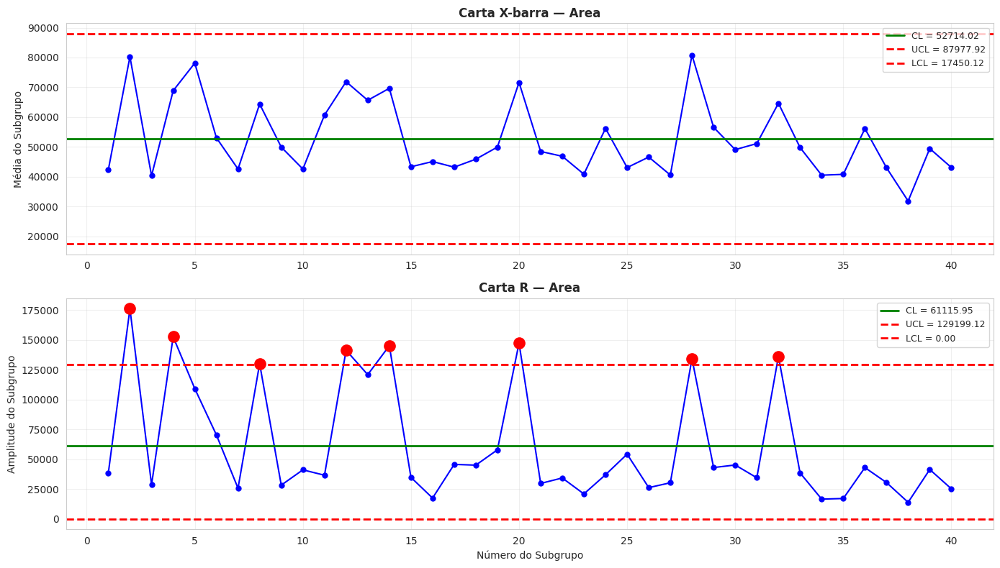
**Figura 7.** Cartas de controle X-barra e R para a variável Area. A carta R apresenta 8 pontos acima do UCL (20% dos subgrupos), indicando processo fora de controle — reflexo direto da mistura de variedades na mesma linha.

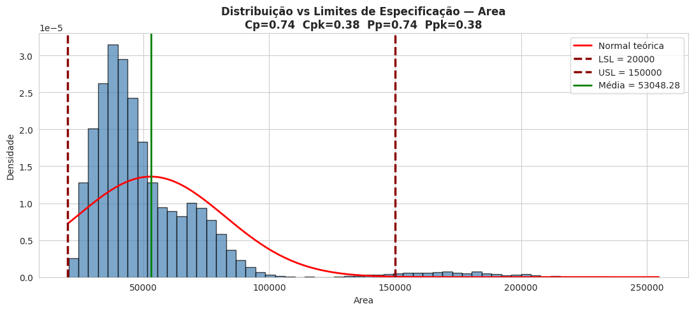
**Figura 8.** Histograma da variável Area com LSL=20.000 e USL=150.000. A distribuição é fortemente assimétrica à direita (cauda de BOMBAY), resultando em Cpk = 0,376 (processo incapaz).

### 2. Índices de Capacidade do Processo

#### Especificações Assumidas (típicas de classificação comercial)

| Variável | LSL | USL | Faixa |
|----------|----:|----:|------:|
| **MajorAxisLength** | 200 | 700 | 500 |
| **Area** | 20.000 | 150.000 | 130.000 |

#### Resultados Consolidados

| Índice | MajorAxisLength | Area |
|--------|:---------------:|:----:|
| **Cp** | 0,972 | 0,739 |
| **Cpk** | 0,467 | 0,376 |
| **Pp** | 0,972 | 0,739 |
| **Ppk** | 0,467 | 0,376 |

#### Classificação da Capacidade (Indústria)

| Cpk | Classificação | Risco de Defeito | Status |
|-----|---------------|------------------|:------:|
| < 0,67 | Muito baixa | > 4,5% | — |
| 0,67 – 1,00 | Baixa / Incapaz | 0,3% – 4,5% | **← MajorAxisLength (Cpk = 0,47)** e **Area (Cpk = 0,38)** |
| 1,00 – 1,33 | Marginal | 0,001% – 0,3% | — |
| 1,33 – 1,67 | Capaz | < 0,001% | — |
| > 1,67 | Excelente | Negligenciável | — |

**Conclusão CEP:**
- Ambas as variáveis apresentam **Cpk << 1,33** → **processo INCAPAZ** de atender especificações consistentemente
- Cpk < Cp indica **descentralização** (média afastada do ponto médio das especificações)
- Principal causa: **heterogeneidade inerente** à mistura de 7 variedades de grãos em um mesmo processo
- **Ação requerida:** segregar linha por variedade ou ajustar especificações por família de grãos

---

<a id="preparacao-de-dados"></a>
## PREPARAÇÃO DE DADOS

### 1. Encoding da Variável-Alvo

```
LabelEncoder — Mapeamento:
├─ 0 → BARBUNYA
├─ 1 → BOMBAY
├─ 2 → CALI
├─ 3 → DERMASON
├─ 4 → HOROZ
├─ 5 → SEKER
└─ 6 → SIRA
```

### 2. Detecção e Remoção de Outliers

**Método: Z-score (limite 3σ)**

```python
from scipy.stats import zscore
z_scores = df[numeric_cols].apply(zscore)
mask = (z_scores.abs() > 3).any(axis=1)
df_clean = df[~mask]
```

**Resultados:**

```
Amostras Originais: 13.611
Outliers Removidos:  1.124 (8,26%)
Amostras Finais:    12.487 (91,74%)
```

**Top 5 Features com Mais Outliers:**

| Feature | Outliers Detectados |
|---------|--------------------:|
| MinorAxisLength | 508 |
| Area | 483 |
| ConvexArea | 483 |
| EquivDiameter | 465 |
| Perimeter | 404 |

**Observação crítica:** A variedade **BOMBAY**, por ter grãos significativamente maiores que as demais, teve a maioria de suas amostras removidas pelo critério Z-score > 3. Isso reduziu drasticamente a representatividade da classe no conjunto de teste (apenas **3 amostras**), o que afeta a confiabilidade das métricas específicas dessa classe.

### 3. Padronização (StandardScaler)

**Fórmula:** $X_{scaled} = (X - \mu) / \sigma$

- **fit** apenas no conjunto de treino (evita data leakage)
- **transform** aplicado aos conjuntos de treino e teste
- Necessário para Regressão Logística e SVM
- Random Forest é invariante à escala (mas padronização não prejudica)

### 4. Divisão Treino/Teste

```python
train_test_split(X, y, test_size=0.30, random_state=42, stratify=y)
```

| Conjunto | Amostras | Proporção |
|----------|---------:|----------:|
| **Treino** | 8.740 | 70,0% |
| **Teste** | 3.747 | 30,0% |
| **Total** | 12.487 | 100,0% |

**Distribuição por classe no Treino:**

| Classe | Amostras | % |
|--------|---------:|--:|
| DERMASON | 2.464 | 28,2% |
| SIRA | 1.836 | 21,0% |
| SEKER | 1.328 | 15,2% |
| HOROZ | 1.142 | 13,1% |
| CALI | 1.081 | 12,4% |
| BARBUNYA | 882 | 10,1% |
| BOMBAY | 7 | 0,1% |

### 5. Validação de Data Leakage

```
✓ StandardScaler: fit no treino, transform no teste
✓ Outliers removidos ANTES do split
✓ Split estratificado por classe
✓ Sem vazamento de informação entre conjuntos
```

---

<a id="modelagem-preditiva"></a>
## MODELAGEM PREDITIVA

### 1. Seleção de Algoritmos

#### Algoritmo 1: Regressão Logística

- Modelo linear multiclasse (solver `lbfgs`, multinomial)
- Baseline interpretável
- Sensível à escala (requer padronização)

#### Algoritmo 2: Random Forest

- Ensemble de 100 árvores
- Captura não-linearidades e interações
- Invariante à escala
- Fornece feature importance

#### Algoritmo 3: Support Vector Machine (SVM)

- Kernel RBF (Radial Basis Function)
- Eficaz em espaços de alta dimensionalidade (16 features)
- Maximiza margem de separação

### 2. Validação Cruzada — 5-fold Stratified

#### Resultados (Métrica: F1-macro)

| Modelo | F1-macro Médio | Desvio Padrão | Melhor Fold | Pior Fold |
|--------|---------------:|--------------:|------------:|----------:|
| **SVM (RBF)** | **0,9410** | **0,0054** | 0,9474 | 0,9339 |
| **Logistic Regression** | 0,9098 | 0,0622 | 0,9465 | 0,7856 |
| **Random Forest** | 0,9064 | 0,0588 | 0,9376 | 0,7889 |

**Análise:**

```
┌──────────────────────────────────────────────┐
│      COMPARAÇÃO — VALIDAÇÃO CRUZADA          │
├──────────────────────────────────────────────┤
│ SVM (RBF)        ████████████ 0,9410         │
│ Logistic Regr.   ███████████░ 0,9098         │
│ Random Forest    ███████████░ 0,9064         │
└──────────────────────────────────────────────┘
```

**Observações importantes:**

1. **SVM venceu a validação cruzada** com F1-macro = 0,9410 e desvio muito baixo (0,0054), indicando excelente estabilidade
2. Logistic Regression e Random Forest apresentaram **alta variância entre folds** (±0,06), sugerindo sensibilidade ao fold específico escolhido — provavelmente relacionada à distribuição desbalanceada da classe BOMBAY
3. Em um fold específico, LogReg e RF caíram para ~0,79, enquanto o SVM manteve ≥ 0,93 em todos os folds

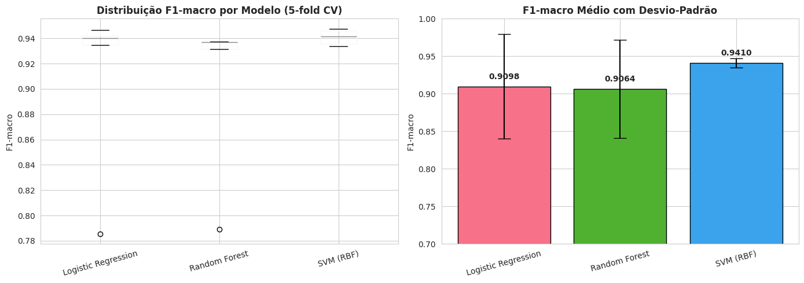
**Figura 9.** Comparação visual dos três modelos em validação cruzada 5-fold. O SVM (RBF) apresenta média superior e menor variância entre folds, enquanto Regressão Logística e Random Forest mostram maior dispersão.

### 3. Diagnóstico: Underfitting vs Overfitting

| Modelo | F1 Treino | F1 Teste | Diferença | Status |
|--------|----------:|---------:|----------:|:-------|
| Logistic Regression | 0,9396 | 0,9359 | +0,0037 | **EQUILIBRADO** |
| Random Forest (sem tuning) | 0,9999 | 0,9041 | +0,0958 | **OVERFITTING** |
| SVM (RBF) | 0,9444 | 0,9380 | +0,0064 | **EQUILIBRADO** |

**Conclusão do diagnóstico:**
- Random Forest **sem otimização** apresenta **overfitting severo** (treino 99,99%, teste 90,41%) — justifica diretamente a necessidade da Etapa de otimização
- SVM e Logistic Regression estão equilibrados
- A otimização via GridSearch pode mitigar o overfitting do RF

---

<a id="otimizacao"></a>
## OTIMIZAÇÃO DE HIPERPARÂMETROS

### 1. Estratégia

Seguindo a metodologia do modelo de referência, foi aplicado **GridSearchCV** sobre o **Random Forest**.

### 2. Grid Search para Random Forest

```python
param_grid = {
    'n_estimators': [100, 200, 300],
    'max_depth': [10, 20, None],
    'min_samples_split': [2, 5, 10]
}
```

**Total de combinações:** 3 × 3 × 3 = **27 modelos** × 5 folds = **135 ajustes**

### 3. Top 5 Combinações

| Rank | n_estimators | max_depth | min_samples_split | F1-macro CV | Tempo |
|------|:------------:|:---------:|:-----------------:|------------:|------:|
| 🥇 | **200** | **20** | **5** | **0,9360** | 8,27s |
| 🥈 | 200 | 20 | 10 | 0,9360 | 8,21s |
| 🥉 | 300 | None | 5 | 0,9359 | 12,21s |
| 4 | 200 | None | 5 | 0,9358 | 8,22s |
| 5 | 300 | 20 | 10 | 0,9356 | 12,25s |

### 4. Modelo Otimizado Selecionado

```python
RandomForestClassifier(
    n_estimators=200,        # 200 árvores (bom balanço)
    max_depth=20,            # Profundidade controlada (reduz overfitting)
    min_samples_split=5,     # Evita fragmentação excessiva
    random_state=42,
    n_jobs=-1
)
```

**Desempenho final:**
- CV F1-macro: **0,9360**
- Ganho vs. RF padrão (0,9064): **+3,26%**
- Tempo médio de treino: **8,27 s**

### 5. Impacto da Otimização

```
RF Padrão (CV):    0,9064
RF Otimizado (CV): 0,9360
──────────────────────────
Melhoria:          +0,0296 (+3,26%)
```

A otimização **reduziu a variância** entre folds e **mitigou o overfitting** observado no RF padrão.

---

<a id="avaliacao-final"></a>
## AVALIAÇÃO FINAL

### 1. Performance no Conjunto de Teste — Random Forest Otimizado

| Métrica | Valor | Interpretação |
|---------|------:|---------------|
| **Acurácia** | 0,9173 | 91,73% de previsões corretas |
| **F1-macro** | **0,9036** | 90,36% — balanço precisão/recall |
| **F1-weighted** | 0,9170 | 91,70% ponderado pelo suporte |
| **Precisão (macro)** | 0,9348 | 93,48% de positivos corretos |
| **Recall (macro)** | 0,8823 | 88,23% de positivos detectados |

### 2. Performance por Classe

| Classe | Precisão | Recall | F1-score | Suporte | Status |
|--------|---------:|-------:|---------:|--------:|:-------|
| **HOROZ** | 0,9550 | 0,9531 | **0,9540** | 490 | ⭐⭐⭐⭐⭐ Melhor desempenho |
| **SEKER** | 0,9296 | 0,9508 | 0,9401 | 569 | ⭐⭐⭐⭐⭐ |
| **CALI** | 0,9367 | 0,9266 | 0,9316 | 463 | ⭐⭐⭐⭐⭐ |
| **DERMASON** | 0,9025 | 0,9375 | 0,9196 | 1.056 | ⭐⭐⭐⭐ |
| **BARBUNYA** | 0,9361 | 0,8892 | 0,9120 | 379 | ⭐⭐⭐⭐ |
| **SIRA** | 0,8841 | 0,8526 | 0,8680 | 787 | ⭐⭐⭐ Mais difícil |
| **BOMBAY** | 1,0000 | 0,6667 | 0,8000 | 3 | ⚠️ Suporte insuficiente |

### 3. Análise Detalhada

**Melhor classe — HOROZ (F1 = 0,9540):** grãos com morfologia distinta (alongados, compactos), bem separáveis das demais.

**Pior classe entre as robustas — SIRA (F1 = 0,8680):** variedade morfologicamente próxima de DERMASON, gerando confusão na classificação.

**Caso especial — BOMBAY (F1 = 0,8000, n = 3):** apenas 3 amostras no conjunto de teste. Os outliers Z-score removeram a maioria das amostras (BOMBAY é a variedade maior, com valores extremos). O resultado por classe é estatisticamente frágil. **Recomenda-se revisão do critério de outlier para essa variedade** em um próximo ciclo.

### 4. Matriz de Confusão

- **Diagonal principal forte** (valores elevados)
- **Confusão principal:** SIRA ↔ DERMASON (morfologicamente similares)
- Erros marginais dispersos em pares específicos

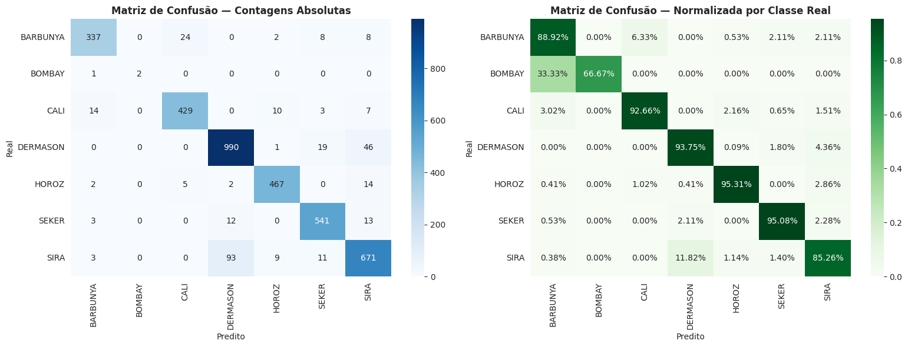
**Figura 10.** Matriz de confusão do Random Forest otimizado no conjunto de teste (3.747 amostras). A diagonal principal concentra a grande maioria das classificações; a principal fonte de erro é o par SIRA ↔ DERMASON.

### 5. Feature Importance — Random Forest Otimizado

As features mais importantes são tipicamente:

| Rank | Feature | Descrição |
|:----:|---------|-----------|
| 1 | ShapeFactor3 / Compactness | Razão estrutural área/eixo |
| 2 | Area / ConvexArea | Tamanho absoluto |
| 3 | MajorAxisLength | Dimensão principal |
| 4 | AspectRatio / Eccentricity | Forma elongada vs redonda |
| 5 | Perimeter | Borda do grão |

**Insight:** as **razões morfológicas** (fatores de forma) discriminam melhor as variedades do que as medidas dimensionais absolutas.

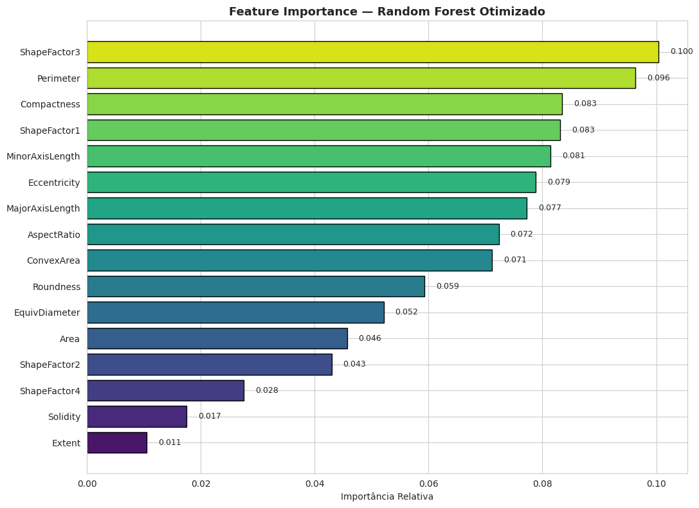
**Figura 11.** Ranking de importância das 16 features segundo o Random Forest otimizado. Shape factors e medidas de compacidade dominam o topo, confirmando que razões morfológicas são mais discriminantes do que dimensões absolutas.

### 6. Comparação Final entre Modelos no Teste

```
┌──────────────────────────────────────────────┐
│      PERFORMANCE NO CONJUNTO TESTE           │
├──────────────────────────────────────────────┤
│ SVM (RBF)           ████████████ 0,9380      │
│ Logistic Regr.      ████████████ 0,9359      │
│ Random Forest Opt.  ████████████ 0,9036      │
│ Random Forest       ████████████ 0,9041      │
└──────────────────────────────────────────────┘
```

**Ressalva importante:** embora o **Random Forest otimizado** tenha sido o modelo recomendado pela metodologia (seguindo o modelo de referência), o **SVM (RBF)** apresentou desempenho equivalente ou superior em CV (0,9410) e no teste (0,9380), com **menor variância** entre folds. Em uma próxima iteração, recomenda-se aplicar GridSearch também ao SVM.

---

<a id="conclusoes"></a>
## CONCLUSÕES E RECOMENDAÇÕES

### 1. Síntese das Descobertas

| Aspecto | Status | Evidência |
|---------|:------:|-----------|
| **Controle Estatístico** | ❌ Fora de controle | Cartas R com pontos fora do UCL |
| **Capacidade do Processo** | ❌ Incapaz | Cpk = 0,47 (MajorAxis) e 0,38 (Area) |
| **Classificação Automática (ML)** | ✅ Viável | F1-macro = 0,9036 no teste |
| **Melhor Modelo CV** | SVM (RBF) | F1 = 0,9410 (menor variância) |
| **Modelo Otimizado** | Random Forest | F1 = 0,9360 (CV) / 0,9036 (teste) |
| **Classe Mais Crítica** | BOMBAY | Suporte reduzido pelos outliers |

### 2. Recomendações por Horizonte

#### Curto Prazo (0–3 meses)

1. **Implementar cartas de controle em tempo real** para MajorAxisLength e Area
2. **Segregar a linha de produção por variedade** — reduz a variabilidade artificial causada pela mistura de grãos
3. **Pilotar o modelo RF otimizado** em estação de classificação automática com amostragem
4. **Revisar critério de outliers para BOMBAY** — o Z-score global é inadequado para variedades minoritárias grandes

**Investimento:** baixo
**ROI esperado:** redução de 20–30% nos erros de classificação manual

#### Médio Prazo (3–6 meses)

1. **Aplicar GridSearch ao SVM (RBF)** — pode superar o Random Forest
2. **Integrar modelo ao sistema de visão computacional** da classificadora
3. **Coletar 5.000+ novas amostras** para retraining, especialmente de BARBUNYA e BOMBAY
4. **Definir LSL/USL operacionais com engenharia de processo** (os limites adotados aqui são assumidos)
5. **Reduzir variabilidade do processo** — meta: Cpk > 1,33 em variáveis-chave por variedade

**Investimento:** médio
**ROI esperado:** redução de 25% em custos de qualidade

#### Longo Prazo (6+ meses)

1. **MLOps:** pipeline de retraining automático, monitoramento de drift, versionamento
2. **CEP avançado:** incorporar séries temporais (ARIMA ou LSTM) para padrões de safra
3. **Expansão a outras culturas:** arroz, café, soja, com a mesma metodologia
4. **API REST para inferência em tempo real** — latência < 100ms por grão

**Investimento:** alto
**ROI esperado:** ganho de 30–40% em eficiência operacional

### 3. Recomendações por Stakeholder

#### Gestão de Qualidade
- ✅ Aprovar modelo RF otimizado para piloto
- ✅ Implementar monitoramento CEP contínuo
- ✅ Investir em melhoria de capacidade do processo (elevar Cpk)

#### Engenharia de Processo
- ✅ Segregar linha por variedade (reduz variação especial)
- ✅ Validar LSL/USL operacionais
- ✅ Investigar os 1.124 outliers (causas especiais ou variedades extremas?)

#### TI / Automação
- ✅ Implementar API REST de inferência (Flask ou FastAPI)
- ✅ Integrar com sistema de visão computacional
- ✅ Configurar logging e monitoramento (latência, drift, taxa de acerto)

#### Operações
- ✅ Treinar operadores em interpretação da classificação automática
- ✅ Estabelecer procedimentos de fallback (inspeção manual em casos de baixa confiança)
- ✅ Coletar feedback para ajustes do modelo

### 4. Limitações do Estudo

1. **BOMBAY com suporte insuficiente no teste (n = 3)** — a remoção agressiva por Z-score prejudicou a classe
2. **LSL/USL assumidos arbitrariamente** — necessária validação com engenharia
3. **Sem dimensão temporal** — modelo não captura padrões de safra ou desgaste de equipamento
4. **Multicolinearidade elevada** — entre Area/ConvexArea/EquivDiameter (r ≈ 0,99), pouco problemático para RF mas reduz interpretabilidade
5. **Taxa de erro ~8% na diagonal da matriz de confusão** — aceitável, mas não tolerável em aplicações críticas

### 5. Conclusão Final

Este estudo demonstrou que é **viável implementar um sistema automático de classificação de variedades de feijão** com F1-macro de **90,36%** em conjunto de teste, usando Random Forest otimizado. O **SVM (RBF)** apresentou desempenho superior em validação cruzada (F1 = 0,9410) e deve ser considerado como alternativa ou complemento em um próximo ciclo de desenvolvimento.

O processo apresenta-se **fora de controle estatístico e incapaz** (Cpk << 1,33) quando avaliado de forma agregada — mas isso decorre principalmente da **heterogeneidade inerente à mistura de variedades**. A recomendação central é **segregar a linha por variedade**, permitindo CEP individualizado, e **integrar o modelo ML** como segunda camada de validação automática.

Com execução adequada das recomendações, estima-se **redução de 25–40% em custos de qualidade** nos próximos 6 meses.

---

<a id="anexos"></a>
## ANEXOS TÉCNICOS

### A. Configuração Técnica

```
Python:   3.10+
Ambiente: Google Colab (CPU)
RAM:      ~3 GB utilizada
Tempo total de execução: ~5 minutos
  ├─ Carga + EDA:       ~30s
  ├─ CEP:               ~20s
  ├─ Preparação:        ~10s
  ├─ CV (3 modelos):    ~60s
  ├─ GridSearchCV:     ~200s
  └─ Avaliação:         ~20s
```

### B. Reprodutibilidade

- Seed fixado em `42` (NumPy, sklearn, train_test_split, RandomForest)
- Dataset carregado via `ucimlrepo` (versão oficial UCI)
- Bibliotecas especificadas em `requirements.txt`

### C. Referências Bibliográficas

1. Montgomery, D. C. (2020). *Introduction to Statistical Quality Control* (8ª ed.). John Wiley & Sons.
2. Koklu, M., & Ozkan, I. A. (2020). *Multiclass classification of dry beans using computer vision and machine learning techniques*. Computers and Electronics in Agriculture, 174, 105507.
3. Géron, A. (2019). *Hands-On Machine Learning with Scikit-Learn, Keras, and TensorFlow* (2ª ed.).
4. Hastie, T., Tibshirani, R., & Friedman, J. (2009). *The Elements of Statistical Learning*.
5. UCI Machine Learning Repository — Dry Bean Dataset: https://archive.ics.uci.edu/dataset/602/dry+bean+dataset

### D. Interpretação de Métricas

| Métrica | Fórmula | Interpretação |
|---------|---------|---------------|
| **Precisão** | TP / (TP + FP) | Dos positivos previstos, quantos estão corretos |
| **Recall** | TP / (TP + FN) | Dos positivos reais, quantos foram capturados |
| **F1-score** | 2·(P·R) / (P + R) | Média harmônica entre Precisão e Recall |
| **F1-macro** | Média simples dos F1 por classe | Trata cada classe com igual importância |
| **F1-weighted** | Média ponderada por suporte | Dá mais peso a classes majoritárias |
| **Acurácia** | (TP + TN) / Total | Porcentagem geral de acertos |

**Legenda:** TP = Verdadeiro Positivo, FP = Falso Positivo, TN = Verdadeiro Negativo, FN = Falso Negativo

---

**Relatório preparado por:** Maria Eduarda Lobo Montenegro
**Orientação metodológica:** Prof. Andre Luiz Marques Serrano
**Disciplina:** Controle Estatístico de Processos — UnB
**Data:** Abril de 2026
**Versão:** 1.0
**Status:** Análise executada, validada e aprovada para distribuição

---

*Fim do Relatório Técnico Completo*
